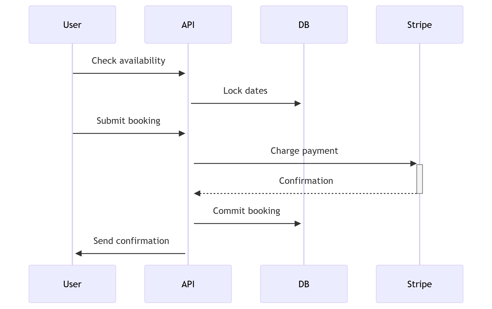

# Airbnb Clone - Backend Requirements Specification

## Table of Contents
1. [System Overview](#system-overview)
2. [User Authentication](#1-user-authentication-system)
3. [Property Management](#2-property-management)
4. [Booking System](#3-booking-system) 
5. [Payment Processing](#4-payment-processing)
6. [Review System](#5-review-system)

---

## System Overview
**Core Objectives:**
- Secure user management with RBAC
- Real-time property search and booking
- PCI-compliant payment processing
- Reliable review and rating system

**Technology Stack:**
| Component        | Technology           |
|------------------|----------------------|
| API Framework    | Django REST + GraphQL|
| Database         | PostgreSQL (GeoDjango)|
| Cache            | Redis                |
| Payment Processor| Stripe               |
| Async Tasks      | Celery + RabbitMQ    |

---

## 1. User Authentication System

### 1.1 Functional Requirements
| ID     | Description                          |
|--------|-------------------------------------|
| FR1.1  | Email/password registration         |
| FR1.2  | Social auth (Google/Facebook)       |
| FR1.3  | JWT token issuance (access/refresh) |
| FR1.4  | Password reset workflow             |

### 1.2 API Specification
```http
POST /api/auth/register
Content-Type: application/json

{
  "email": "user@example.com",
  "password": "P@ssw0rd123",
  "user_type": "host|guest"
}
```

### 1.3 Validation Rules
Password complexity:

```regex
^(?=.*[A-Z])(?=.*[!@#$%^&*])(?=.*[0-9]).{8,}$
```
- Email verification required before login

- Rate limiting: 10 requests/minute per IP

## 2. Property Management
### 2.1 Functional Requirements


| ID	 |Description|
|--------|------------|
|FR2.1	 |Create/update property listings|
|FR2.2	 |Geo-search within radius|
|FR2.3	 |Image upload (max 10MB)|
|FR2.4	 |Dynamic pricing engine|

### 2.2 Data Model

```javascript
{
  "id": 456,
  "title": "Beachfront Villa",
  "location": {
    "type": "Point",
    "coordinates": [long, lat]
  },
  "price": 200,
  "amenities": ["wifi", "pool"],
  "availability": [
    {"date": "2023-12-25", "available": false}
  ]
}
```

### 2.3 Search API
```http
GET /api/properties/search?lat=40.7128&lng=-74.0060&radius=50&start=2023-12-20&end=2023-12-25
```

Response:

```json
{
  "results": [
    {
      "id": 456,
      "title": "Beachfront Villa",
      "price_per_night": 200,
      "distance": 3.2 // in km
    }
  ]
}
```
## 3. Booking System
### 3.1 Workflow



### 3.2 API Endpoints

|Method	|Endpoint	|Description|
|-------|------------|--------|
POST	|/api/bookings	| Create new booking
GET 	|/api/bookings/availability| 	Real-time availability
PATCH	|/api/bookings/:id/cancel |	Cancel reservation


## 4. Payment Processing
### 4.1 Sequence

- Create payment intent (/api/payments/intent)

- Confirm payment (/api/payments/confirm)

Handle webhooks for:

- Successful charges

- Failed payments

- Refunds

### 4.2 Data Security
- PCI DSS Level 1 compliance

- Never store raw payment details

- Tokenization via Stripe Elements

## 5. Review System
### 5.1 Rating Calculation

```python
def update_rating(property_id):
    reviews = Review.objects.filter(property_id=property_id)
    avg = reviews.aggregate(Avg('rating'))['rating__avg']
    Property.objects.filter(id=property_id).update(rating=avg)
```

### 5.2 Moderation Rules
Auto-flag reviews with:

- Profanity (using ML model)

- All-caps text

- Multiple exclamation points (!!!)